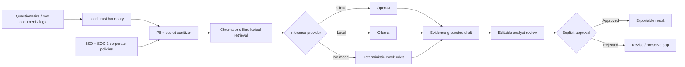
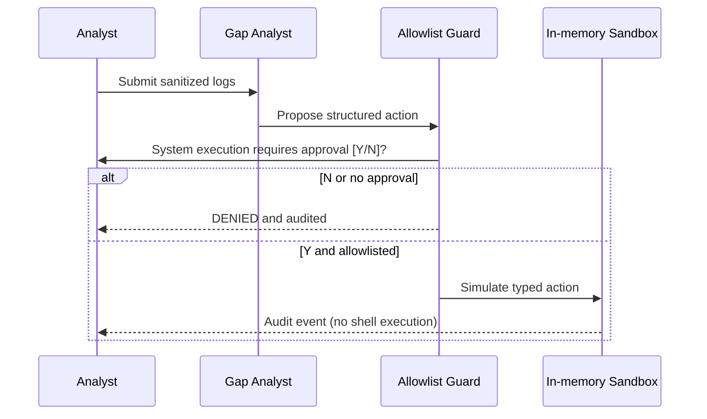

# Compliance Assurance & Control Evidence Agent

A portfolio-grade GRC workspace inspired by the human-in-the-loop assurance
workflow used by modern security questionnaire teams. It drafts questionnaire
answers, screens raw documentation against **ISO 27001:2022** and **SOC 2 Type
II**, and analyzes security logs for policy deviations. Every result remains an
editable draft until a human analyst approves it.

> This is a readiness and evidence-analysis tool. It does not issue ISO
> certification or a SOC 2 attestation; those require qualified independent
> auditors and, for Type II, evidence from an operating review period.

## Why this aligns with SecurityPal

Security assurance teams lose time locating evidence, repeating questionnaire
answers, and translating technical records into defensible customer responses.
This project demonstrates the product loop that matters: retrieve controlled
corporate evidence, draft a traceable answer, expose gaps instead of
hallucinating, and keep an accountable reviewer in control. The log workflow
extends that loop from reactive questionnaires to proactive control assurance.

## Architecture



The log-remediation path has a second, deterministic gate:



## Workflows

- **Questionnaire assurance** — uploads TXT, CSV, or JSON, retrieves policy
  evidence, and produces editable answers with explicit evidence gaps.
- **Document readiness** — accepts pasted raw text or uploaded TXT/LOG/CSV/JSON/
  Markdown and returns a framework-by-framework ISO 27001 and SOC 2 Type II
  readiness report.
- **Log gap analyst** — combines deterministic anomaly detection with
  policy-grounded analysis and proposes constrained remediation actions.
- **Guardrail sandbox** — supports only `DISABLE_ACCOUNT`, `REVOKE_SESSIONS`,
  `BLOCK_NETWORK_INDICATOR`, and `OPEN_INCIDENT`. It deliberately simulates
  execution in memory and never invokes a terminal, shell, or subprocess.

## Security controls and OWASP LLM mapping

| OWASP risk | Implemented control |
|---|---|
| LLM01 Prompt Injection | System prompt treats uploads and retrieval as untrusted data; embedded instructions are ignored. |
| LLM02 Sensitive Information Disclosure | Emails, IPv4/IPv6, SSNs, labeled passport IDs, Luhn-valid payment cards, and credential layouts are redacted before retrieval or inference. |
| LLM03 Supply Chain | Dependencies are constrained by compatible major versions and kept in one reviewable manifest. |
| LLM04 Data and Model Poisoning | Policy files are a local, explicit corpus; sources are shown to the reviewer. |
| LLM05 Improper Output Handling | Model text is displayed as an editable draft and never interpreted as shell code. |
| LLM06 Excessive Agency | Fixed action allowlist, explicit Y/N approval, simulation-only execution, and an exportable audit trail. |
| LLM07 System Prompt Leakage | Prompts contain no credentials; provider keys stay server-side through environment variables. |
| LLM08 Vector and Embedding Weaknesses | Sanitization occurs before embedding; collections are fingerprinted and chunks use stable IDs. |
| LLM09 Misinformation | Evidence-only prompt, source display, required `GAP IDENTIFIED` output, and certification disclaimers. |
| LLM10 Unbounded Consumption | Small retrieval limit, bounded chunk size, Pydantic request limits, and deterministic offline mode. |

## Run locally

Recommended Docker path:

```bash
docker compose up --build --remove-orphans
```

The default **Mock (offline)** provider needs no API key, model download, or
internet connection.

## React chat interface

The repository also includes a separated modern chat-style frontend in
`frontend/` and a FastAPI streaming bridge in `backend_api.py`. The AI/security
engine lives in `app.py`, while the user interface runs through the React chat
app with localStorage session history and an AbortController-backed Stop button.

### Run with Docker Compose

```bash
docker compose up --build
```

Then open:

```text
http://localhost:5173
```

The Compose stack starts:

- `secai-frontend` — React/Vite chat interface on port `5173`.
- `secai-api` — FastAPI secured RAG/compliance API on port `8000`.

Optional environment values:

```bash
OPENAI_API_KEY=sk-... docker compose up --build
OLLAMA_BASE_URL=http://host.docker.internal:11434 docker compose up --build
```

### Ollama with Docker Compose

If Ollama is running on your host, the API container must be able to reach it.
Host-side `curl http://localhost:11434/api/tags` is not enough if Ollama is
bound only to `127.0.0.1`. Start Ollama so Docker containers can connect:

```bash
OLLAMA_HOST=0.0.0.0:11434 ollama serve
ollama pull nomic-embed-text
ollama pull llama3.2
docker compose up --build --remove-orphans
```

Then confirm from the backend container:

```bash
curl http://localhost:8000/ollama-health
```

Alternatively, run Ollama as a Docker sidecar:

```bash
docker compose -f docker-compose.yml -f docker-compose.ollama.yml up --build
```

The sidecar pulls `nomic-embed-text` for embeddings and `llama3.2` for chat.

### Run without Docker

Terminal 1:

```bash
uvicorn backend_api:app --reload --host 0.0.0.0 --port 8000
```

Terminal 2:

```bash
cd frontend
npm install
npm run dev
```

Open `http://localhost:5173`. The React frontend calls the backend at
`http://localhost:8000` by default; set `VITE_AGENT_API_URL` to point at a
deployed API.

For fully local model-backed RAG:

```bash
ollama pull llama3.2
ollama pull nomic-embed-text
ollama serve
```

Choose `Ollama (local)` in the React composer. For OpenAI, set
`OPENAI_API_KEY` on the backend process or Compose environment. Never commit a
local secrets file.

## Portfolio demo

1. Start in Mock mode to show the application has no vendor or network
   dependency.
2. Paste a policy or procedure into **Document readiness** and compare its ISO
   and SOC 2 findings.
3. Upload `mock_security_events.log` in **Log gap analyst**.
4. Select a proposed remediation, submit `N`, then `Y`, and export the audit log
   to demonstrate the approval boundary.
5. Switch to Ollama or OpenAI to demonstrate model-backed evidence synthesis.

Corporate policy fixtures are in `company_iso_policies/`. They intentionally
include control design and operating-evidence expectations so the app can
distinguish “a policy exists” from “a control operated effectively.”

## Basic checks

```bash
python3 -m py_compile app.py backend_api.py
npm run build --prefix frontend
```

I also manually checked the main safety paths: email/IP/SSN/passport/card/secret
redaction, mock log detection, denied execution approval, rejected non-allowed
actions, and successful simulated remediation. No live model call is required
for these local checks.
